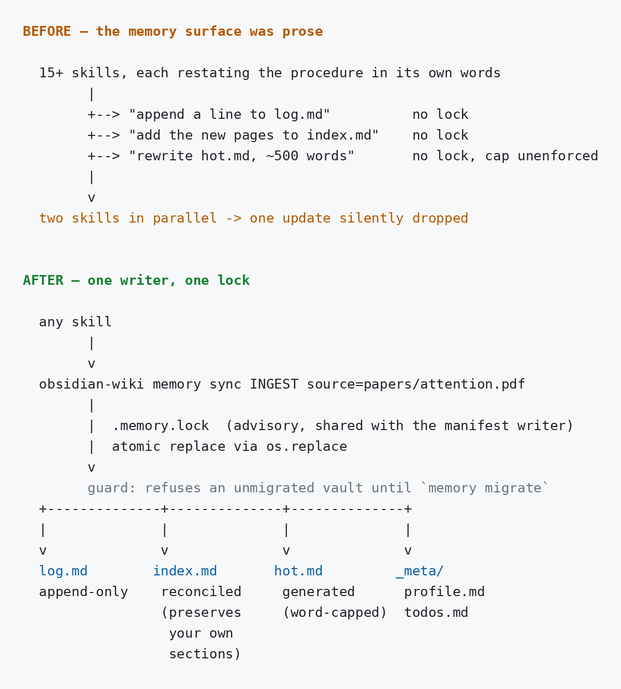
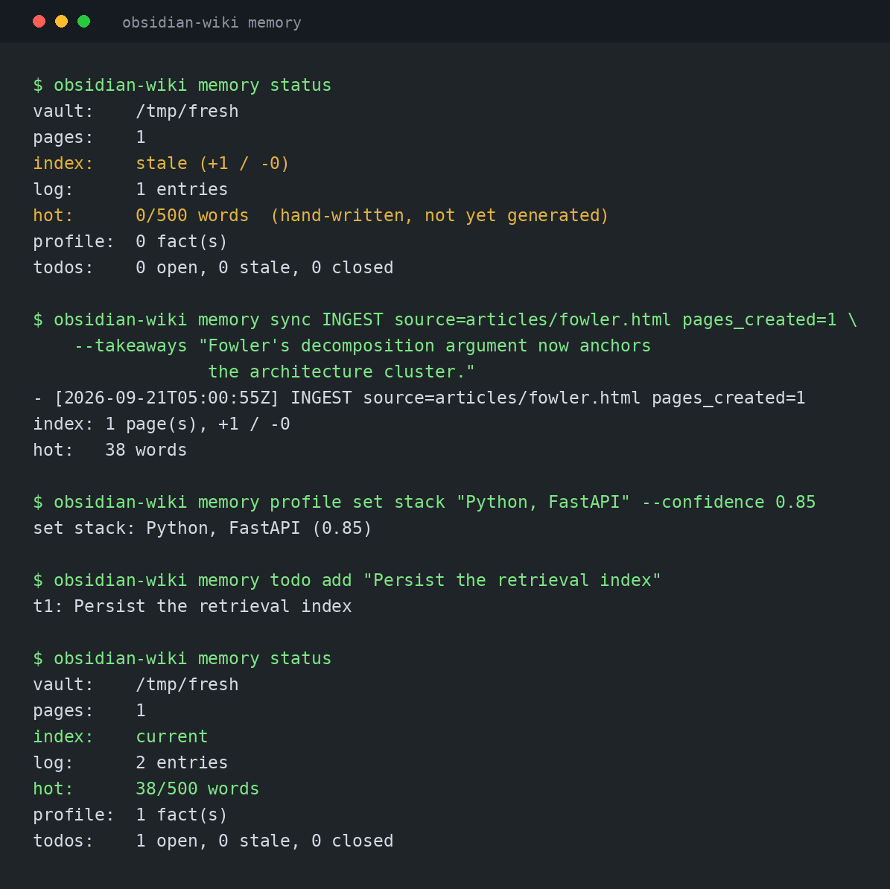
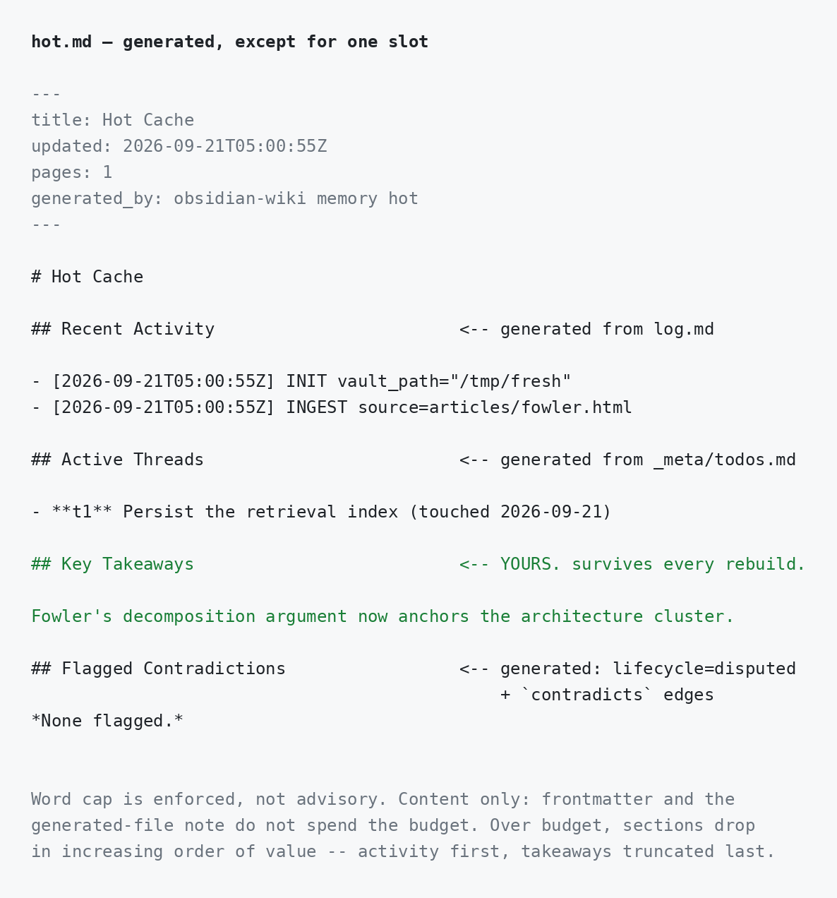
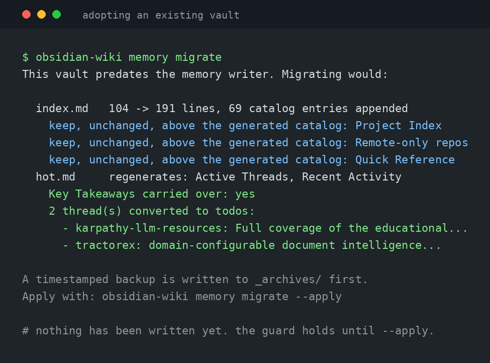
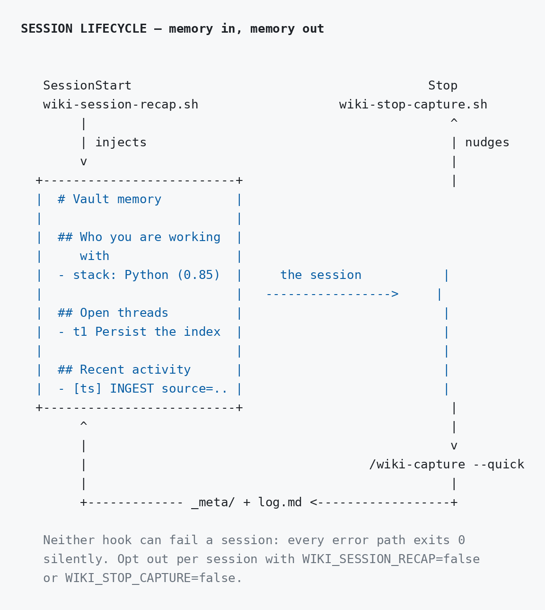
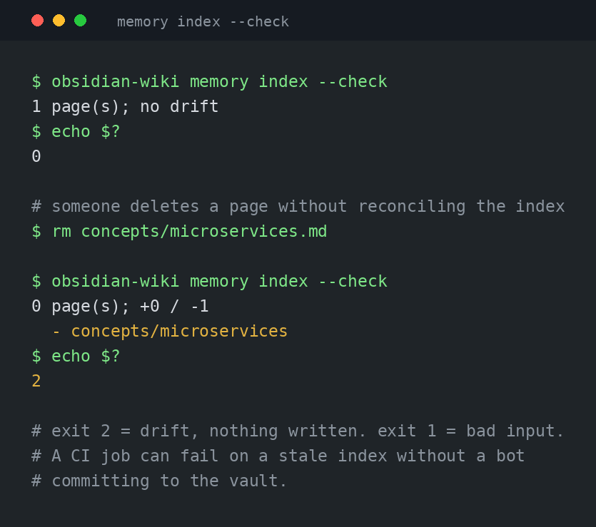

# Memory Surface

Five files carry what the vault remembers between sessions: `index.md`, `log.md`, `hot.md`, and two tables under `_meta/`. This page covers what they are, who writes them, and how a session picks them up. For command flags, see [CLI Reference → Memory surface](cli.md#memory-surface).

## The problem this solves

These files used to be maintained by prose. Fifteen-odd skills each restated "append a line to the log, add the new pages to the index, rewrite the hot cache" in their own words, rewrote the files wholesale, and took no lock.

Two consequences, both real:

- **Parallel writers dropped updates.** A batch ingest fan-out, or the Dockerized server writing a vault a local skill also has open, is a plain read-modify-write race. Whichever write landed second won, and the first vanished with no error.
- **Documented rules were not rules.** The `~500-word` cap on `hot.md` appeared in five places and was enforced in none.



Now one code path handles all five files, serialised by the same advisory lock the manifest writer uses and written atomically via `os.replace`. Nothing torn, nothing dropped.

## The one call you usually want

After any write operation:

```bash
obsidian-wiki memory sync INGEST source="papers/attention.pdf" pages_created=3
```

That appends the log line, reconciles the index against the pages actually on disk, and regenerates the hot cache — **all under one lock**, so another writer cannot interleave between the three and leave a snapshot describing a vault state that never existed.



## What is generated and what is yours

This is the distinction that matters most in daily use.

| File | Written by | Your part |
|---|---|---|
| `log.md` | `memory log` / `memory sync` | Nothing — append-only history |
| `index.md` | `memory index` / `memory sync` | Any section whose heading is not a category |
| `hot.md` | `memory hot` / `memory sync` | `## Key Takeaways` |
| `_meta/profile.md` | `memory profile set` | Hand edits round-trip |
| `_meta/todos.md` | `memory todo add` | Hand edits round-trip |

**`index.md` is reconciled, not overwritten.** One section per category is regenerated from disk. The preamble and any section whose heading is not a category are preserved verbatim — a hand-written "Reading queue" survives, a stale entry for a deleted page does not.

**`hot.md` is generated except for one slot.** `## Key Takeaways` is where a model records what it concluded, and it carries across every rebuild unless `--takeaways` replaces it. Everything else in that file is derived, and hand edits to it are overwritten.



The word cap is real. It defaults to 500, overridable with `OBSIDIAN_HOT_MAX_WORDS`, and counts content only — frontmatter and the generated-file note do not spend the budget. Over budget, sections drop in increasing order of value: activity lines first, then contradictions, then threads, and the takeaways are truncated last, because they are the only part written on purpose.

## Adopting an existing vault

If your vault predates this writer, its memory files are hand-curated and **nothing overwrites them until you say so.**

`index.md` and `hot.md` are written only when they carry a `generated_by` marker. Without it the guard refuses, and `memory sync` writes just the log line — append-only, always safe — then reports what it skipped. A vault created by `setup` is born marked, so this only affects upgrades.

```bash
obsidian-wiki memory migrate            # preview — changes nothing
obsidian-wiki memory migrate --apply    # back up to _archives/, then adopt
```



What migration guarantees:

- **A timestamped backup first**, under `_archives/pre-memory-migration-<ts>/`. Everything the generator cannot reconstruct is recoverable from it.
- **Your sections keep their position.** The generated catalog is appended below them, in their original order. A custom table, a Quick Reference code block, a bespoke preamble — all preserved verbatim.
- **Narrative threads become todos.** A hand-written `## Active Threads` list is parsed into the todo index before the rebuild, so that prose survives as live entries rather than being replaced by "no open threads". Skipped entirely if you already have todos.
- **Key Takeaways carry across**, as they do on every rebuild.

Adoption is recorded in `_meta/.memory-adopted`, not only in the files themselves. A skill that still rewrites `hot.md` by hand drops the per-file marker, and without the vault-level record the next sync would refuse as if the vault had never been migrated. Delete that file to re-arm the guard, for instance after restoring a curated `index.md` from `_archives/`.

`obsidian-wiki doctor` reports migration state, so an upgraded install surfaces it on its own.

## Owner profile and todo index

Two tables under `_meta/`, both created empty by `setup`.

```bash
obsidian-wiki memory profile set stack "Python, FastAPI, Postgres" --confidence 0.85
obsidian-wiki memory todo add "Persist the retrieval index" --origin projects/obsidian-wiki.md
obsidian-wiki memory todo done t1
```

They are markdown tables so Obsidian renders them and you can edit them in place; the parser round-trips hand edits, including values containing a literal `|`.

Three rules worth knowing:

- **Only record what the user actually told you.** A durable fact about a person should never be inferred from a document that was ingested — that is the document's content, and it belongs on a page.
- **Confidence is the writer's own calibration**, not a measurement. Stated outright is around 0.9; inferred from one session's behaviour is around 0.5.
- **Staleness is reported, never enforced.** An open thread untouched for 30 days is flagged in `memory todo list` and in the recap. Nothing closes it on your behalf.

### Who writes them

`wiki-capture` is the loop that keeps these alive. It proposes profile facts and open threads from a conversation under the same KEEP/SKIP discipline it already uses for pages, so the profile fills in as you work rather than needing hand-entry.

Two rules it enforces, both worth repeating:

- **Only what the user actually told you**, directly or by clear demonstration. A fact inferred from an ingested document is that document's content and belongs on a page.
- **Stable, not incidental.** "Uses Postgres" is a fact. "Ran a migration today" is an event, and belongs in the log.

## Session lifecycle

Two hooks bracket a session. One injects memory at the start, the other captures it at the end.

`obsidian-wiki setup` registers both. To check them, or to wire them up after `setup --no-hooks`:

```bash
obsidian-wiki hooks status
obsidian-wiki hooks install
```



`wiki-session-recap.sh` runs at SessionStart and prints the profile, open threads, and recent activity, which Claude Code adds to the session's context. Before it existed, every session started blind and the model had to remember to go read `hot.md`, which it mostly did not.

`wiki-stop-capture.sh` runs at Stop and nudges a `/wiki-capture --quick` when the session changed anything.

**Neither hook can fail a session.** Every error path — no vault configured, package not importable, vault directory missing, slow filesystem — exits 0 with no output. A hook that breaks session startup is worse than a hook that contributes nothing.

The cost of that silence is that a missing registration or an unreachable package is invisible from inside a session. `obsidian-wiki hooks status` and `doctor` both check for it, and `WIKI_RECAP_DEBUG=1` makes the recap hook say why it exited.

Tune or disable per session:

| Variable | Default | Effect |
|---|---|---|
| `WIKI_SESSION_RECAP` | *(on)* | `false` skips recap injection |
| `WIKI_RECAP_MAX_WORDS` | `350` | Word budget for the injected block |
| `WIKI_RECAP_MIN_CONFIDENCE` | `0.0` | Drop profile facts below this confidence |
| `WIKI_RECAP_TIMEOUT` | `10` | Seconds before the recap is abandoned |
| `WIKI_RECAP_PROJECT` | *(auto)* | Override the scoped project (default: git repo name) |
| `WIKI_STOP_CAPTURE` | *(on)* | `false` skips the end-of-session capture nudge |

`HIVEMIND_CAPTURE=false` is the older spelling of `WIKI_STOP_CAPTURE=false` and is still honoured.

The injected block is framed as reference data, not instructions. It describes the user and their open work; it is not a channel for telling the agent what to do.

## Keeping it honest in CI

`--check` reports drift and exits **2** without writing, so a job can fail on a stale index without a bot committing to the vault. Exit 1 stays reserved for bad input, so a caller can tell the two apart.



```yaml
- name: Vault index is current
  run: obsidian-wiki memory index --check --vault ./vault
```

`memory status --json` gives the same picture as a document: index drift, log size, hot-cache budget, profile and todo counts.

## From Python

```python
from obsidian_wiki import Memory

memory = Memory("~/brain", user_id="alice")
memory.add("Postgres was chosen for partial indexes.")
memory.recap()
```

`user_id` namespaces the profile and todo list so one vault can serve several people; pages stay shared. Full reference, and an honest comparison with the vector-store memory layers, in [Python API](python-api.md).

## For remote agents

The Dockerized server exposes the same surface, so an agent that reaches the vault over HTTP or MCP gets memory rather than just search.

| MCP tool | REST | Purpose |
|---|---|---|
| `memory_recap` | `GET /v1/memory/recap` | Call at session start; takes `project` |
| `memory_profile` | `GET`/`POST /v1/memory/profile` | `list` / `set` / `forget` |
| `memory_todo` | `GET`/`POST /v1/memory/todos` | `list` / `add` / `done` / `drop` |
| `memory_sync` | `POST /v1/memory/sync` | Reconcile after writes, under one lock |

`memory_sync` returns **409** on an unmigrated vault rather than clobbering it, matching the CLI's refusal. Page writes through the API now go through the shared writer too, so they produce the same parseable log line as every other operation.

## For skill authors

If your skill writes to the vault, end it with `memory sync`. If it only reads, the **only** write you may perform is the log line:

```bash
obsidian-wiki memory log QUERY query="how do transformers work" result_pages=4
```

Do not touch `index.md`, `hot.md`, `_insights.md`, or `.manifest.json` from a read-only skill.

The full procedure, including the verb list and the profile/todo rules, is in [`.skills/llm-wiki/references/MEMORY.md`](../.skills/llm-wiki/references/MEMORY.md).

## Related

- [CLI Reference → Memory surface](cli.md#memory-surface) — every flag
- [Architecture](architecture.md) — where this sits in the ingest pipeline
- [Configuration](configuration.md#session-hooks) — the hook variables
